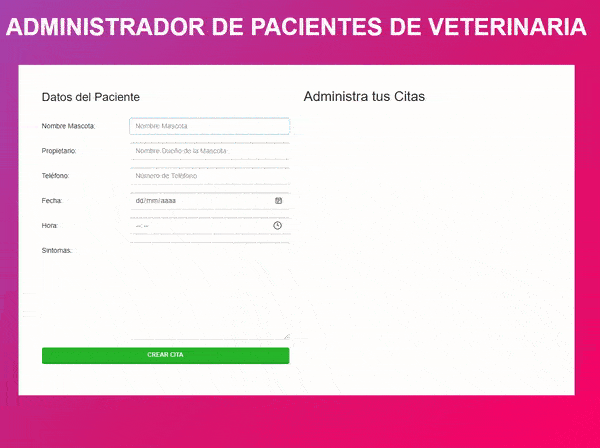

# Veterinary Management

Una pequeña app para administrar pacientes de una veterinaria. Permite registrar, editar y eliminar citas, almacenando la información localmente mediante IndexedDB.

## Demo

Para mirar la demo del proyecto visita: [Veterinary Management](https://mariokarajallo.github.io/veterinary-management-javascript/)



## Características

- **Gestión de Citas**: Permite agregar nuevas citas con información detallada (Mascota, Propietario, Teléfono, Fecha, Hora, Síntomas).
- **Edición**: Posibilidad de modificar los datos de una cita existente.
- **Eliminación**: Opción para borrar citas que ya no son necesarias.
- **Persistencia de Datos**: Utiliza **IndexedDB** para guardar las citas en el navegador, asegurando que los datos no se pierdan al recargar la página.
- **Validaciones**: Sistema de validación para asegurar que todos los campos obligatorios estén completos.
- **Interfaz Dinámica**: Actualización en tiempo real de la lista de citas sin recargar la página.

## Tecnologías utilizadas

- **HTML5**: Estructura semántica de la aplicación.
- **CSS3**: Estilos personalizados y uso del framework **Bootstrap** para el diseño responsivo.
- **JavaScript (ES6+)**: Lógica de la aplicación.
  - **Clases**: Programación Orientada a Objetos para organizar el código (`App`, `Citas`, `UI`).
  - **Módulos**: Importación y exportación de funciones y clases para un código modular.
  - **IndexedDB**: Base de datos no relacional en el navegador para persistencia.

## Instalación y requisitos

Este proyecto no requiere instalación de dependencias de backend ni compilación.

1. **Clonar el repositorio**:
   ```bash
   git clone https://github.com/mariokarajallo/veterinary-management-javascript.git
   ```
2. **Abrir el proyecto**:
   Navega a la carpeta del proyecto y abre el archivo `index.html` en tu navegador web preferido.

**Requisitos**:

- Un navegador web moderno (Chrome, Firefox, Edge, Safari) con soporte para ES6 Modules e IndexedDB.

## Cómo funciona

La aplicación se inicializa a través de la clase `App`, que configura los eventos y la base de datos.

1. **Inicio**: Al cargar la página, se crea la base de datos en IndexedDB y se cargan las citas existentes.
2. **Agregar Cita**: El usuario llena el formulario. Al enviar, se valida la información y se agrega al estado global y a IndexedDB.
3. **Listado**: La clase `UI` se encarga de renderizar las citas en el DOM.
4. **Edición/Eliminación**: Cada cita tiene botones para editar (carga los datos en el formulario) o eliminar (borra de la BD y del DOM).

### Validaciones

El sistema valida que:

- Todos los campos del formulario (Mascota, Propietario, Teléfono, Fecha, Hora, Síntomas) tengan contenido.
- Si algún campo está vacío, se muestra una alerta de error en pantalla.
- Si la validación es exitosa, se procede a guardar o actualizar la cita.

## Estructura de archivos

```bash
.
├── index.html
├── js
│   ├── app.js
│   ├── funciones.js
│   ├── selectores.js
│   └── Clases
│       ├── App.js
│       ├── Citas.js
│       └── UI.js
├── css
│   └── (archivos de estilo)
├── LICENSE
└── README.md
```

- **index.html**: Punto de entrada de la aplicación, contiene la estructura HTML y el formulario.
- **js/app.js**: Archivo principal que instancia la clase `App` para iniciar la aplicación.
- **js/funciones.js**: Contiene funciones auxiliares para la lógica de negocio, manejo de IndexedDB y callbacks de eventos.
- **js/selectores.js**: Selecciona y exporta los elementos del DOM necesarios (inputs, formulario, contenedores).
- **js/Clases/App.js**: Clase encargada de la inicialización y configuración de los Event Listeners.
- **js/Clases/Citas.js**: Clase que gestiona el estado de las citas (agregar, eliminar, editar en el arreglo en memoria).
- **js/Clases/UI.js**: Clase responsable de todas las operaciones visuales (mostrar alertas, imprimir citas en el HTML).

## Contribuciones

¡Las contribuciones son bienvenidas! Si deseas mejorar este proyecto, sigue estos pasos:

1. Haz un **Fork** del repositorio.
2. Crea una nueva rama para tu funcionalidad (`git checkout -b feature/NuevaFuncionalidad`).
3. Realiza tus cambios y haz **Commit** (`git commit -m 'Agrega nueva funcionalidad'`).
4. Haz **Push** a la rama (`git push origin feature/NuevaFuncionalidad`).
5. Abre un **Pull Request**.

### Sugerencias

- Mejorar el diseño visual.
- Agregar funcionalidad de búsqueda de citas.
- Implementar notificaciones más avanzadas.

## Créditos

- **Juan Pablo De la Torre Valdez** - Instructor y autor del contenido del curso - [Codigo Con Juan](https://codigoconjuan.com/).
- **Mario Karajallo** - Implementación del proyecto y mantenimiento - [Mario Karajallo](https://karajallo.com).

## Licencia

Este proyecto está bajo la licencia MIT. Véase `LICENSE.md` para más detalles.

---

⌨️ con ❤️ por [Mario Karajallo](https://karajallo.com)
